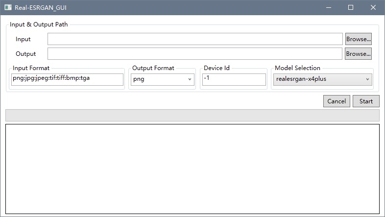
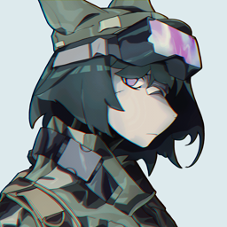
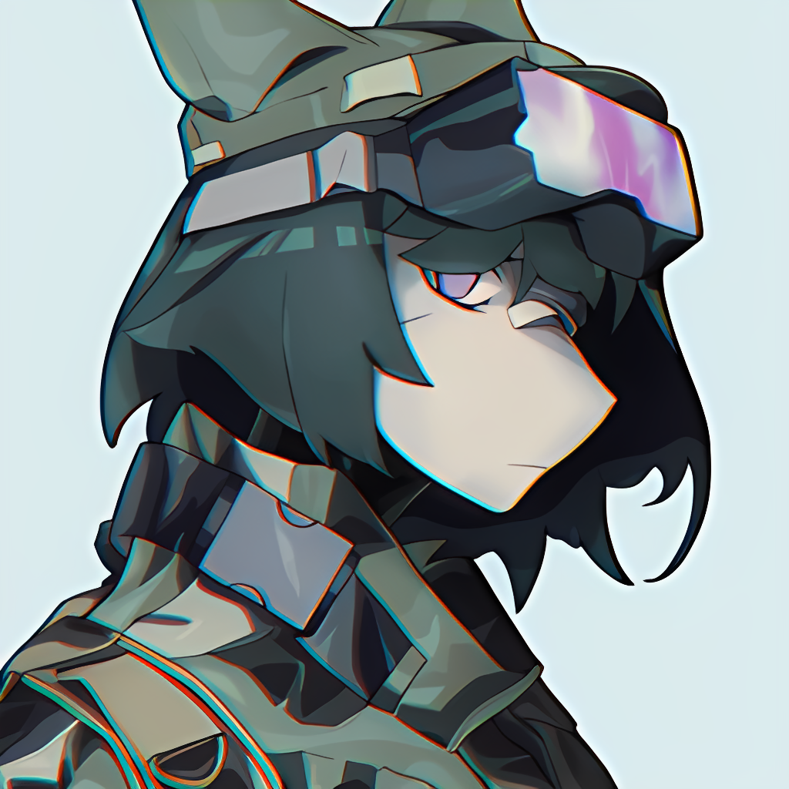

# Real-ESRGAN_GUI
A C# GUI super-resolution inference utility of [Real-ESRGAN](https://github.com/xinntao/Real-ESRGAN) with GPU acceleration powered by DirectML.

[[中文README]](README_zh.md)

PRs are welcomed.

## Usage
Install .NET Desktop Runtime 5.0.15 or higher. (x64)

And then I guess you probably know how a GUI works. ;-)

To use GPU acceleration, a DirectML compatible GPU and an installation of Windows 10 1709 or higher is required. Set the device id to the GPU that you want to use to enable GPU acceleration (on single GPU PC, 0 is the default GPU. However, on some PC with an integrated GPU, 0 is the integrated GPU and 1 is the dedicated GPU). Check out [here](https://github.com/microsoft/DirectML#hardware-requirements) for a more specific hardware requirements.

The model with a suffix of "6B" is recommended for illustrations while the one with not is recommened for real-life images.

## Result
From  to  with the magic of [Real-ESRGAN](https://github.com/xinntao/Real-ESRGAN).

## Build Prerequisites
- Visual Studio 2019 or higher.

## Convert models
Please see [Convert_Models_From_PyTorch.md](./Convert_Models_From_PyTorch.md)

## Known Issue
- GPU accleration is not working on some environment (may yield a black image).
- Directory input is not implemented yet.
- Alpha channel will be discarded. If you need to this channel you may export the alpha channel as an individual image and process it separately, and merge them together with image manipulation softwares like GIMP afterwards.
- Huge memory consumption when handling large image (\~1000x1000, eats up \~18.5G memory easily).

## Acknowledgements
This repository contains ONNX models converted from [Real-ESRGAN](https://github.com/xinntao/Real-ESRGAN) repo. All copyrights and trademarks of the materials used belong to their respective owners and are not being sold.

This repository is created only for learning purpose. I DO NOT take any responsibilities for any possible damages.

Image [upscale example](./assets/avatar_256px.png) and [result](./assets/avatar_256px_realesrgan-x4plus_anime_6B.png) attached in assets folder are derivatives of my personal artwork for my own SNS avatar. Please do not use without permission, especially for commercial purposes.

2022, net2cn.